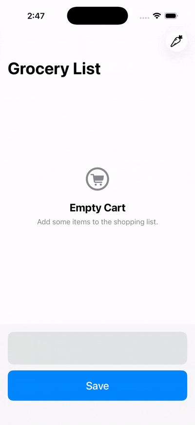

# GroceryList App

This is a **SwiftUI** app designed to help users organize their grocery shopping efficiently. The Grocery List App allows users to create, manage, and track their grocery items in a convenient way. It offers features that enhance the shopping experience by simplifying the process of adding and checking off items as users shop.
**APP PREVIEW :**

  

## 🛠 Technical Stack & Architecture

• Xcode version : 26.4

• Language : Swift 6

• Framework: SwiftData and TipKit

 
## 🚀 Features

• Item Management: Users can add, remove, and mark items as completed

• Notification for Empty Lists: Users receive context-sensitive feedback when their grocery list is empty

• Intuitive UI: An organized layout that facilitates easy navigation and interaction

• TipKit framework is used to guide users about app's functionality

• SwiftData is used for data persistence

## 💡 What I Learned

• Designing using SwiftUI

• TipKit Framework - Implemented to help users discover new functionalities within the app

• Data Persistence using SwiftData

